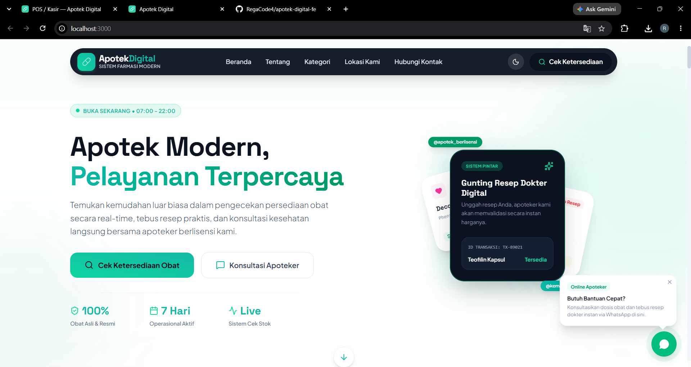

<div align="center">
  <h1>Apotek Digital</h1>
  <p>A modern, fast, and responsive frontend application for the Apotek Digital system.</p>
</div>

<br />

<div align="center">
  
</div>

<br />

## About the Project

**Apotek Digital** is a state-of-the-art web application designed to manage and digitalize pharmacy operations. This frontend repository is built with a focus on beautiful aesthetics, dynamic micro-animations, and a seamless user experience.

## Features

- **Modern UI/UX**: Built with premium design aesthetics, carefully curated color palettes, and a highly interactive interface.
- **Dark Mode Support**: System-aware and user-toggleable dark mode tailored with custom styling.
- **Real-Time Stock Checker**: Live integration with backend API to display available, low, and out-of-stock medicines.
- **Micro-Animations**: Smooth interactions and transitions using GSAP and Motion for an engaging user experience.
- **Fast & Responsive**: Fully responsive layout ensuring a great experience across desktop, tablet, and mobile devices.
- **Robust Form Handling**: Efficient and type-safe form validation using React Hook Form.

## Technology Stack

This project is built using the latest web technologies to ensure performance and developer experience:

- **Core**: [React 19](https://react.dev/) + [Vite](https://vitejs.dev/)
- **Styling**: [TailwindCSS v4](https://tailwindcss.com/)
- **Animations**: [GSAP](https://gsap.com/) & [Motion](https://motion.dev/)
- **Icons**: [Lucide React](https://lucide.dev/)
- **Language**: [TypeScript](https://www.typescriptlang.org/)

## Getting Started

Follow these instructions to set up and run the project locally.

### Prerequisites

- Node.js (v18 or higher recommended)
- npm, yarn, pnpm, atau bun
- Laravel Backend API (running on `http://localhost:8000` by default)

### Installation

1. **Clone the repository:**
   ```bash
   git clone <repository-url>
   ```

2. **Navigate to the project directory:**
   ```bash
   cd apotek-digital-fe
   ```

3. **Install dependencies:**
   ```bash
   npm install
   ```

4. **Environment Setup:**
   Create a `.env` file in the root directory (if not exists) and configure your API URL:
   ```bash
   VITE_API_BASE_URL=http://localhost:8000
   ```

5. **Start the development server:**
   ```bash
   npm run dev
   ```
   *The server will start on `http://localhost:3000` (or `http://0.0.0.0:3000`).*

## Available Scripts

Di dalam direktori project, Anda dapat menjalankan perintah berikut:

- `npm run dev` : Memulai *development server*.
- `npm run build` : Melakukan *build* aplikasi untuk *production* ke folder `dist/`.
- `npm run preview` : Menjalankan *preview server* secara lokal untuk melihat hasil *build*.
- `npm run lint` : Menjalankan pengecekan *type* pada TypeScript.
- `npm run clean` : Membersihkan folder hasil *build*.

<br />

---
<div align="center">
  <sub>Built for Apotek Digital</sub>
</div>
